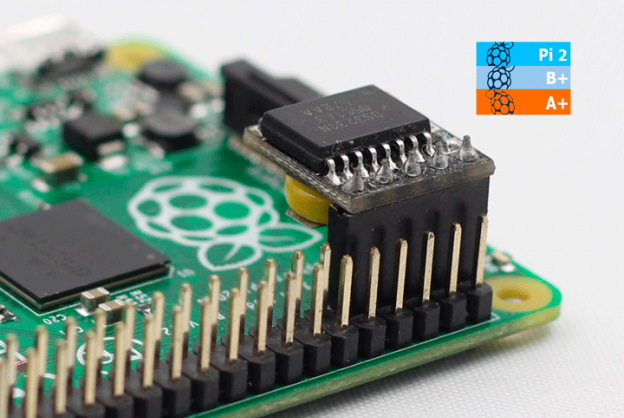
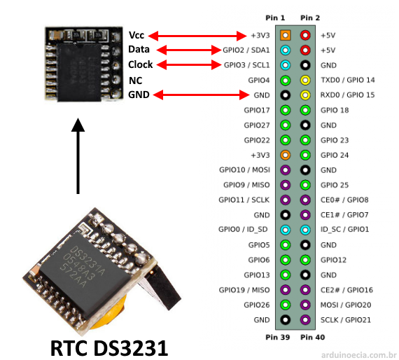

<p align="center"></p>
<h1 align="center">RTC DS3231 module in a Raspberry Pi </h1> 
<h4 align="right">Agu 24</h4>


<br>

<p align="center"></p>
<p align="center"></p>

<br>

# Install

1. Habilitar I2C en Raspberry Pi: <br>
Ejecuta ```sudo raspi-config```. Selecciona Interfacing Options y luego selecciona I2C. Habilita el I2C. Reinicia la Raspberry Pi con ```sudo reboot```.

2. Instalar herramientas de I2C:<br>
Para verificar que el módulo RTC esté correctamente conectado, instala las herramientas de I2C.

```bash
sudo apt-get update && sudo apt-get full-upgrade
sudo apt-get install i2c-tools
sudo reboot
```

3. Verificar el RTC DS3231:<br>
Ejecuta el siguiente comando para asegurarte de que la Raspberry Pi detecta el RTC:

```bash
sudo i2cdetect -y 1
```
Debes ver el dispositivo en la dirección 0x68. Si aparece, el RTC está correctamente conectado.

4. Configurar el RTC DS3231:<br>
Ahora, vamos a indicarle al sistema que use el RTC DS3231. Para hacer esto. Abre el archivo config.txt.

```bash
sudo nano /boot/config.txt
```
Agrega la siguiente línea al final del archivo para habilitar el uso del RTC:

```bash
dtoverlay=i2c-rtc,ds3231
```
Guarda y cierra el archivo.

5. Desactivar el reloj por software:
La Raspberry Pi usa un reloj de software por defecto (fake-hwclock). Debemos desactivarlo:

```bash
sudo apt-get -y remove fake-hwclock
sudo update-rc.d -f fake-hwclock remove
sudo systemctl disable fake-hwclock
```
6. Actualizar los scripts de inicio:
El RTC ahora debe configurarse para sincronizar la hora al arrancar. Modifica el archivo ```/lib/udev/hwclock-set```.

```bash
sudo nano /lib/udev/hwclock-set
```
Busca las siguientes líneas y coméntalas agregando # al inicio de cada línea:

```bash
if [ -e /run/systemd/system ] ; then
    exit 0

```
Estas líneas deben quedar así:

```bash
#if [ -e /run/systemd/system ] ; then
#    exit 0
#fi
```
Guarda y cierra el archivo.

7. Reiniciar la Raspberry Pi: <br>
```bash
sudo reboot
```

8. Verificar la hora del RTC:<br>
Después del reinicio, puedes verificar la hora del RTC ejecutando:

```bash
sudo hwclock -r
```
Si el comando muestra la hora correcta, el RTC está configurado correctamente.

9. Sincronizar el RTC con la hora del sistema:
Si necesitas sincronizar la hora del sistema con el RTC, puedes hacerlo con el siguiente comando.

```bash
sudo hwclock -w
```

## Summary Commands
```bash
sudo hwclock -r  # Para leer la fecha y hora desde el dispositivo RTC
sudo hwclock -w # Para escribir la fecha y hora desde al dispositivo RTC
sudo date -s "13 APR 2016 13:06:00" # poner la hora manual
cat /proc/driver/rtc //Podemos obtener más inf RTC
sudo hwclock --set --date=<date_string> # poner la hora manual
```

<br>

# Configurar RTC como servicio en SYSTEMD (opcional):
Para que la sincronización del RTC se ejecute como un servicio de sistema en SYSTEMD, podemos crear un archivo de servicio personalizado.

Crea el archivo de servicio:

```bash
sudo nano /etc/systemd/system/rtc-sync.service
```
Agrega el siguiente contenido:

```bash
[Unit]
Description=RTC-RPi
After=network.target

[Service]
ExecStart=/sbin/hwclock --hctosys

[Install]
WantedBy=multi-user.
```
Guarda y cierra el archivo, luego habilítalo:

```bash
sudo systemctl enable rtc-sync.service
sudo systemctl start rtc-sync.service
sudo systemctl daemon-reload
```
Con esto, cada vez que la Raspberry Pi se reinicie, se sincronizará la hora del sistema con el RTC DS3231 automáticamente.


## Comandos SYSTEMD Utiles
```bash
sudo systemctl status rtc-sync.service
sudo systemctl stop rtc-sync.service
sudo systemctl start rtc-sync.service
sudo systemctl disable rtc-sync.service
sudo systemctl enable rtc-sync.service
sudo systemctl restart rtc-sync.service
systemctl --failed  #ver los servicios que fallaron
sudo systemctl daemon-reload # Recarga su configuración. Esto es necesario después de hacer cambios en los archivos de configuración de unidades
```

## Verifica funcionamiento del RTC:
```bash
sudo journalctl | grep # Verifica los mensajes relacionados con el RTC
sudo journalctl | grep rtc # Para verificar la detección del RTC.
sudo journalctl -b | grep rtc # Verifica los mensajes de arranque 
sudo journalctl | grep hwclock # Verifica los mensajes del servicio hwclock (para revisar si el sistema usa el RTC para sincronizar el reloj)
sudo journalctl | grep timedatectl # Verificar mensajes de timedatectl y sincronización de tiempo
sudo journalctl -p  # Buscar errores 
sudo journalctl -p warning # Buscar advertencias
```


## NTP servicio (habilita o desabilita la actualizacion de internet)
```
timedatectl status
sudo timedatectl set-ntp false
sudo timedatectl set-ntp true
timedatectl set-time '2020-01-17 20:54:00' # NB the format is YYYY-MM-DD HH:MM:SS
```


<br>

---
Copyright &copy; 2022 [carjavi](https://github.com/carjavi). <br>
```www.instintodigital.net``` <br>
carjavi@hotmail.com <br>
<p align="center">
    <a href="https://instintodigital.net/" target="_blank"></a>
</p>


# RTC-rpi
Install an RTC DS3231 module in a Raspberry Pi
